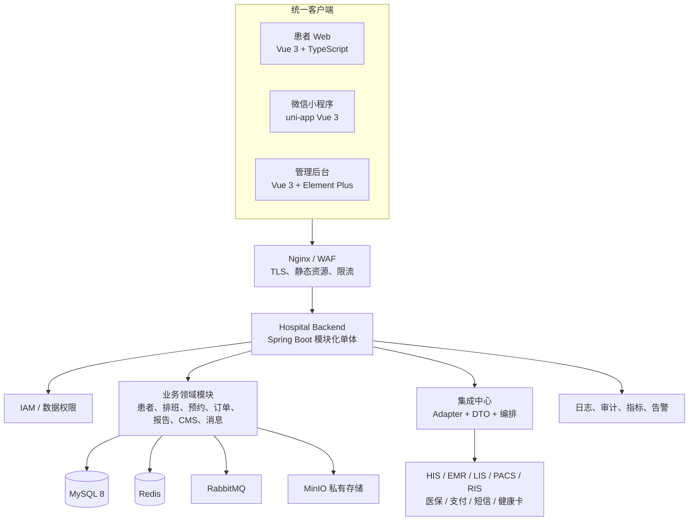

# 系统架构设计

## 1. 全景架构

## 2. 客户端架构

### 患者 Web

采用 Vue 3 + TypeScript + Vite（若 SEO 成为明确需求，再评估迁移 Nuxt）。按功能切分 `home`、`appointment`、`reports`、`payment`、`profile`；使用响应式布局、最小字号/对比度规范和服务端权限状态。只保存短期会话与非敏感展示偏好，禁止缓存病历、身份证全量和报告正文。

### 管理后台

采用 Vue 3 + TypeScript + Vite + Pinia + Vue Router + Element Plus。路由由服务端下发的菜单权限过滤，按钮显示只是体验控制，API 必须再次鉴权。功能按 `iam`、`organization`、`doctor`、`schedule`、`appointment`、`cms`、`message`、`audit`、`configuration` 分包；表格查询遵循数据范围和字段脱敏。

### 微信小程序

采用 uni-app + Vue 3 + TypeScript，编译目标为微信原生小程序。以分包降低首包体积：主包（认证、首页、导航）+ 预约、报告、支付、我的分包；支付、订阅消息、授权与登录仅调用微信官方能力，业务决定仍由统一后端完成。小程序不内置任何支付密钥或第三方业务密钥。

## 3. 后端模块与分层

`bootstrap` 负责启动与装配；`common` 提供错误码、响应、审计上下文、加密和安全组件；每个领域模块包含 `interfaces`（Controller/请求响应 DTO）、`application`（用例/事务）、`domain`（规则/模型）、`infrastructure`（Mapper/外部实现）。`integration` 是唯一允许接触外部 SDK/协议的模块。

统一实现：JWT 短令牌 + 旋转 Refresh Token、全局异常处理、参数校验、OpenAPI、分页、幂等键、操作/审计事件、字段脱敏、Trace ID。生产环境依赖由环境变量或密钥管理服务注入。

## 4. 关键一致性与高可用

排班发布后直接写 MySQL 并清理/更新缓存，患者端读取服务端可用号源。提交预约时以患者、医生/科室、日期和门诊规则做重复校验；使用 Redis Lua 原子预占防止瞬时超卖，并以数据库 `available_count > 0` 条件更新、唯一索引、乐观锁和事务作为最终兜底。订单超时由可重试任务释放预占；所有回调以外部流水号去重并记录审计。

单体可以水平扩展为无状态应用；Redis、MySQL、MQ、MinIO 的高可用拓扑应由目标 RPO/RTO 决定。二期出现独立扩缩容、独立发布或数据主权需求后，优先拆分集成与消息，再评估预约/支付，禁止仅为“微服务化”拆分。

## 5. 部署与可观测性

开发、测试、生产环境隔离。Docker Compose 用于开发/测试的一键依赖环境；生产使用受控镜像仓库、独立密钥、备份恢复和变更流程，禁止默认密码。Nginx/WAF 终止 TLS，后端仅接受可信代理转发。输出结构化日志，监控延迟、错误率、连接池、Redis、MQ 堆积、预约库存不一致、支付回调失败和集成失败；告警不得携带敏感字段。
